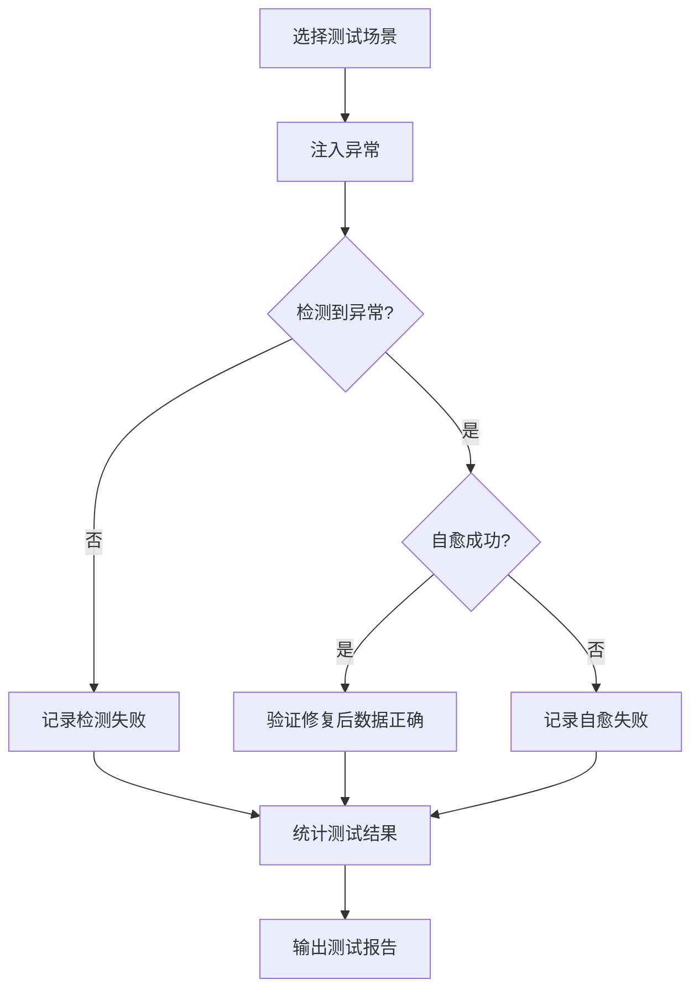

# 天枢权衡 — 数据质量体系建设规划

> Phase 2 交付物：建设任务拆解表 + 异常场景测试库 + 进度台账

---

## 一、建设任务拆解表

### 批次1（高优先级，5项）

| 任务ID | 关联需求 | 实现方案 | 检测逻辑 | 自愈规则 | 验收标准 | 优先级 |
|:------|:---------|:---------|:---------|:---------|:---------|:------:|
| DQ-IMP-01 | DQ-04 | `scripts/dq_scanner.py` 数据质量扫描脚本 | 五维指标扫描五池+决策日志+报告 | 自动修复字段缺失+格式错误 | 扫描结果与人工检查一致 | 🔴 **高** |
| DQ-IMP-02 | DQ-01 | 集成到 dq_scanner 的 score=0 检测 | 检查评分=0的标的，入池>3天 | ML评分兜底+强制降级+告警 | score=0标的<3天自动降级 | 🔴 **高** |
| DQ-IMP-03 | DQ-02 | 决策报告退化检测 | 报告结构完整性+关键字段存在性 | 重试→降级模型→规则模式 | 退化检测准确率>90% | 🔴 **高** |
| DQ-IMP-04 | DQ-03 | 格式漂移检测 | 正则匹配成功率统计+趋势检测 | 多级fallback+告警 | 格式漂移5分钟内告警 | 🔴 **高** |
| DQ-IMP-05 | DQ-05 | `scripts/dq_daily_report.py` 数据质量日报 | 汇总所有检测结果+趋势 | 每日推送报告 | 日报包含所有指标+趋势 | 🔴 **高** |

### 批次2（中优先级，5项）

| 任务ID | 关联需求 | 实现方案 | 检测逻辑 | 自愈规则 | 验收标准 | 优先级 |
|:------|:---------|:---------|:---------|:---------|:---------|:------:|
| DQ-IMP-06 | DQ-06 | 行情API完整性检查 | HTTP状态+字段完整性+时效 | 多源切换+缓存补充 | 行情缺失1分钟内补数 | 🟡 **中** |
| DQ-IMP-07 | DQ-07 | 跨池重复检测 | 代码去重+跨池校验 | 自动去重保留最新 | 0重复 | 🟡 **中** |
| DQ-IMP-08 | DQ-08 | 数据陈旧检测 | 更新日期+时间衰减公式 | 强制刷新+告警 | 陈旧数据自动标记 | 🟡 **中** |
| DQ-IMP-09 | DQ-09 | 决策日志完整性 | 记录数+日期范围+缺失检查 | 自动补录+告警 | 日志完整>95% | 🟡 **中** |
| DQ-IMP-10 | DQ-10 | 异常留痕JSONL | 统一格式+去重+时间戳 | 自动归档 | 所有异常可追溯 | 🟡 **中** |

### 批次3（低优先级，4项）

| 任务ID | 关联需求 | 实现方案 | 检测逻辑 | 自愈规则 | 验收标准 | 优先级 |
|:------|:---------|:---------|:---------|:---------|:---------|:------:|
| DQ-IMP-11 | DQ-11 | JSON Schema校验 | 字段名+类型+必需性 | 字段映射转换 | 一致性>99% | 🟢 **低** |
| DQ-IMP-12 | DQ-12 | 配置一致性检测 | 代码硬编码 vs 配置对比 | 同步覆盖 | 0不一致 | 🟢 **低** |
| DQ-IMP-13 | DQ-13 | 股票代码校验 | 6位数字+市场前缀 | 自动修正 | 0无效代码 | 🟢 **低** |
| DQ-IMP-14 | DQ-14 | ML模型时效 | 训练日期 vs 当前日期 | 告警重训 | 模型<30天 | 🟢 **低** |

---

## 二、异常场景测试库

### 测试场景清单

| 场景ID | 异常类型 | 注入方式 | 预期检测结果 | 预期自愈行为 |
|:------|:---------|:---------|:-------------|:-------------|
| TC-01 | score=0 | 手动将池中标的评分设为0 | 检测到异常，告警 | ML评分兜底+强制降级 |
| TC-02 | LLM退化 | 决策报告替换为空模板 | 退化检测触发 | 重试→降级 |
| TC-03 | 格式漂移 | 审查报告格式改为旧格式 | 正则匹配率下降告警 | fallback匹配 |
| TC-04 | 重复标的 | 同一代码写入两个池 | 跨池重复检测 | 自动去重 |
| TC-05 | 缺失行情 | 模拟API返回空 | 检测到缺失 | 多源切换+缓存 |
| TC-06 | 数据陈旧 | 池中更新日期改为3天前 | 陈旧检测触发 | 告警+强制刷新 |
| TC-07 | 字段缺失 | 边缘池移除综合分字段 | 字段完整性告警 | 默认值填充 |
| TC-08 | JSON格式错误 | 手动损坏JSON文件 | 解析失败告警 | 从备份恢复 |
| TC-09 | 股票代码无效 | 写入非6位代码 | 有效性校验失败 | 自动修正+告警 |
| TC-10 | 决策日志重复 | 同一天记录追加两次 | 重复检测 | 去重保留唯一 |

### 测试流程



---

## 三、进度台账

```json
{
  "project": "天枢数据质量体系",
  "started": "2026-07-24",
  "current_phase": 3,
  "items": {
    "DQ-IMP-01": {"status": "in_progress", "batch": 1, "type": "scanner"},
    "DQ-IMP-02": {"status": "pending", "batch": 1, "type": "score0"},
    "DQ-IMP-03": {"status": "pending", "batch": 1, "type": "degradation"},
    "DQ-IMP-04": {"status": "pending", "batch": 1, "type": "format_drift"},
    "DQ-IMP-05": {"status": "pending", "batch": 1, "type": "daily_report"},
    "DQ-IMP-06": {"status": "pending", "batch": 2, "type": "market_data"},
    "DQ-IMP-07": {"status": "pending", "batch": 2, "type": "duplicate"},
    "DQ-IMP-08": {"status": "pending", "batch": 2, "type": "stale"},
    "DQ-IMP-09": {"status": "pending", "batch": 2, "type": "decision_log"},
    "DQ-IMP-10": {"status": "pending", "batch": 2, "type": "traceability"},
    "DQ-IMP-11": {"status": "pending", "batch": 3, "type": "schema"},
    "DQ-IMP-12": {"status": "pending", "batch": 3, "type": "config"},
    "DQ-IMP-13": {"status": "pending", "batch": 3, "type": "code_valid"},
    "DQ-IMP-14": {"status": "pending", "batch": 3, "type": "ml_model"}
  }
}
```

---

## 变更记录

| 版本 | 日期 | 变更内容 | 作者 |
|:----:|:----:|---------|:----:|
| v1.0 | 2026-07-24 | 初始创建 | 七郎 |