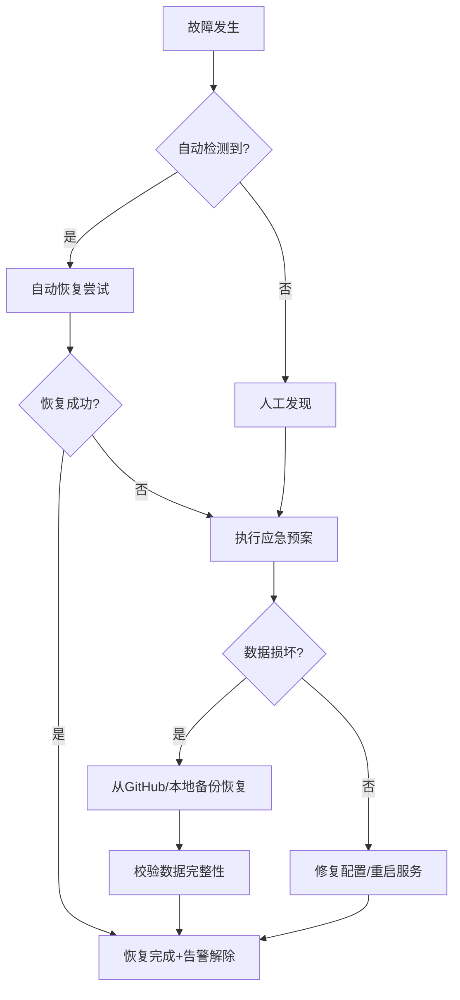

# 天枢权衡 — 高可用容灾架构设计方案

> Phase 1 交付物：现状审计 + 架构设计 + 建设清单

---

## 一、现状审计摘要

### 1.1 部署现状

| 维度 | 现状 | 风险等级 |
|:-----|:-----|:--------:|
| 部署架构 | 单机部署（Linux 2核/8GB/194GB） | 🔴 高 |
| 进程管理 | Hermes gateway + agent 作为唯一进程，无 systemd 守护 | 🔴 高 |
| 定时调度 | Hermes Cron 单线程串行，无备用调度器 | 🔴 高 |
| 数据存储 | 本地文件系统（37MB总量），无实时复制 | 🔴 高 |
| 外部依赖 | LLM API + 行情API + 新闻源 + SMTP + GitHub | 🟡 中 |
| 网络依赖 | 单一网络出口，无备用线路 | 🟡 中 |
| 备份机制 | Git push + pool_backup.py（仅备份五池JSON） | 🔴 高 |
| 监控告警 | 无，故障依赖人工发现 | 🔴 高 |
| 恢复能力 | 无自动化恢复流程，依赖手动操作 | 🔴 高 |

### 1.2 单点故障清单

| 编号 | SPOF | 影响范围 | 影响程度 | 现有缓解 |
|:----:|:-----|:---------|:--------:|:---------|
| SPOF-01 | 物理服务器宕机 | 全系统不可用，交易中断 | 🔴 致命 | 无 |
| SPOF-02 | Hermes gateway 进程崩溃 | 定时任务不执行，决策中断 | 🔴 致命 | 无 |
| SPOF-03 | 磁盘故障 | 数据丢失（五池/报告/日志） | 🔴 致命 | 无 |
| SPOF-04 | LLM API 不可用 | 全流程中断（新闻/快筛/审查/决策） | 🔴 致命 | 3次重试 + 降级模型 |
| SPOF-05 | 行情API不可用（东方财富/腾讯） | 审查/决策缺少行情数据 | 🟡 严重 | 多源探测 |
| SPOF-06 | 新闻源不可用（DuckBurn/新浪） | 新闻分析失败 | 🟡 严重 | 多源fallback |
| SPOF-07 | 网络中断 | 全流程中断 | 🔴 致命 | 无 |
| SPOF-08 | SMTP 邮件服务不可用 | 报告投递失败 | 🟢 一般 | 日志记录 |
| SPOF-09 | 配置文件损坏 | 系统启动失败 | 🟡 严重 | 无 |
| SPOF-10 | 数据文件损坏（五池JSON） | 持仓/决策数据丢失 | 🔴 致命 | 无 |

### 1.3 容灾能力缺口

| 能力项 | 当前状态 | 目标状态 | 缺口 |
|:-------|:---------|:---------|:-----|
| 系统可用率 | 99%（单机） | 99.9% | 无主备，宕机即掉线 |
| 故障切换时长 | N/A | <5分钟 | 无自动化切换 |
| 数据恢复点目标(RPO) | 24小时（Git push） | <15分钟 | 缺少实时备份 |
| 数据恢复时间目标(RTO) | 数小时（手动恢复） | <30分钟 | 缺少自动化恢复 |
| 备份校验 | 无 | 每日自动校验 | 缺少校验机制 |
| 监控告警 | 无 | 实时告警 | 缺少监控系统 |

---

## 二、高可用容灾架构设计

### 2.1 总体架构

```
┌─────────────────────────────────────────────────────┐
│                    生产环境 (单机)                     │
│                                                       │
│  ┌──────────────┐    ┌──────────────────────────┐    │
│  │  systemd 守护  │◄───│  Hermes Gateway + Agent  │    │
│  │  (自动重启)    │    │  (定时任务调度器)         │    │
│  └──────────────┘    └──────────┬───────────────┘    │
│                                 │                     │
│  ┌──────────────────────────────▼────────────────┐   │
│  │              数据持久化层                        │   │
│  │  ┌──────────┐ ┌──────────┐ ┌──────────────┐   │   │
│  │  │ 五池JSON  │ │ 报告文件  │ │ 决策日志JSON  │   │   │
│  │  └─────┬────┘ └────┬─────┘ └──────┬───────┘   │   │
│  └────────┼────────────┼──────────────┼───────────┘   │
│           │            │              │                │
│  ┌────────▼────────────▼──────────────▼────────────┐  │
│  │             备份层                                │  │
│  │  ┌──────────────┐  ┌────────────────────────┐   │  │
│  │  │ 本地定时备份   │  │ 远程备份 (GitHub/rsync) │   │  │
│  │  │ (每15分钟)    │  │ (每日/每次变更)        │   │  │
│  │  └──────────────┘  └────────────────────────┘   │  │
│  └─────────────────────────────────────────────────┘  │
│                                                       │
│  ┌────────────────────────────────────────────────┐   │
│  │             监控告警层                           │   │
│  │  ┌──────────┐ ┌──────────┐ ┌──────────────┐   │   │
│  │  │ 进程监控  │ │ 数据校验  │ │ 可用性仪表盘  │   │   │
│  │  └──────────┘ └──────────┘ └──────────────┘   │   │
│  └────────────────────────────────────────────────┘   │
└─────────────────────────────────────────────────────┘
```

### 2.2 架构设计原则

1. **单机强化优先**：在现有单机环境下最大化可用性，后续扩展到双机
2. **数据不丢**：任何故障下确保五池数据、决策日志、报告不丢失
3. **自动恢复**：常见故障（进程崩溃、API超时）自动恢复，无需人工介入
4. **可观测**：所有组件状态可监控，异常自动告警
5. **平滑升级**：架构改造不影响现有实盘运行

### 2.3 关键设计决策

| 决策 | 方案 | 理由 |
|:-----|:-----|:------|
| 进程守护 | systemd service | 系统内置，零依赖，自动重启 |
| 数据备份 | 本地快照 + GitHub远端 | 数据量小(37MB)，GitHub天然支持版本+异地 |
| 备份频率 | 关键数据15分钟，非关键数据每日 | 平衡RPO与资源消耗 |
| 监控方案 | 健康检查脚本 + 飞书/邮件告警 | 复用现有飞书推送通道 |
| 故障切换 | 脚本自动检测+自动恢复 | 单机环境无需复杂切换逻辑 |
| 容灾恢复 | 脚本化一键恢复 | 从GitHub拉取+重建五池 |

---

## 三、建设任务清单

### 高优先级（核心单点消除）

| 任务ID | 建设项 | 架构作用 | 可用性提升 | 优先级 |
|:------|:-------|:---------|:----------:|:------:|
| HA-01 | systemd 服务化 | 进程守护+自动重启 | 消除SPOF-02 | 🔴 **高** |
| HA-02 | 数据自动备份脚本 | 15分钟间隔备份五池+报告 | 消除SPOF-03 | 🔴 **高** |
| HA-03 | 备份校验脚本 | 每日自动校验备份完整性 | 提升RPO可靠性 | 🔴 **高** |
| HA-04 | 一键恢复脚本 | 从GitHub/本地备份恢复数据 | 降低RTO | 🔴 **高** |
| HA-05 | 进程监控告警 | 进程异常→飞书/邮件告警 | 消除SPOF-01/02 | 🔴 **高** |
| HA-06 | 数据完整性校验 | 五池JSON+决策日志格式校验 | 消除SPOF-10 | 🔴 **高** |

### 中优先级（容灾能力）

| 任务ID | 建设项 | 架构作用 | 可用性提升 | 优先级 |
|:------|:-------|:---------|:----------:|:------:|
| HA-07 | 冷备环境搭建文档 | 备机就绪时快速切换 | 消除SPOF-01 | 🟡 **中** |
| HA-08 | 配置备份与版本管理 | config.yaml + .env 备份 | 消除SPOF-09 | 🟡 **中** |
| HA-09 | 网络连通性监控 | 自动检测API/网络可达性 | 监测SPOF-07 | 🟡 **中** |
| HA-10 | 日志自动裁剪 | 日志大小控制+保留策略 | 防止磁盘满 | 🟡 **中** |
| HA-11 | 可用性仪表盘 | 实时系统状态+可用性统计 | 提升可观测性 | 🟡 **中** |

### 低优先级（演练优化）

| 任务ID | 建设项 | 架构作用 | 可用性提升 | 优先级 |
|:------|:-------|:---------|:----------:|:------:|
| HA-12 | 故障切换演练 | 模拟主进程崩溃→验证自动恢复 | 验证HA-01 | 🟢 **低** |
| HA-13 | 数据恢复演练 | 模拟数据损坏→验证恢复流程 | 验证HA-04 | 🟢 **低** |
| HA-14 | 故障应急预案文档 | 各类故障的标准响应流程 | 提升响应速度 | 🟢 **低** |
| HA-15 | 定期演练机制 | 每月自动演练+报告 | 保障持续可用 | 🟢 **低** |

---

## 四、可用性指标目标

| 指标 | 当前值 | 目标值 | 衡量方式 |
|:-----|:------:|:------:|:---------|
| 系统可用率 | ~99% | **99.9%** | (总时间-宕机时间)/总时间 |
| 年宕机时间 | ~87小时 | **<8.76小时** | 365天×24小时×(1-可用率) |
| 故障切换时长 | N/A | **<5分钟** | 从故障发生到恢复的时间 |
| 数据恢复点(RPO) | 24小时 | **<15分钟** | 最近一次备份的时间差 |
| 数据恢复时间(RTO) | 数小时 | **<30分钟** | 从故障到数据恢复的时间 |
| 备份校验覆盖率 | 0% | **100%** | 已校验备份数/总备份数 |
| 演练频率 | 从不 | **每月1次** | 实际演练次数/月 |

---

## 五、容灾策略

### 5.1 故障分级响应

| 级别 | 定义 | 响应时间 | 响应动作 |
|:----:|:-----|:--------:|:---------|
| P0 | 系统完全不可用、数据丢失风险 | <5分钟 | 立即告警+自动恢复+人工介入 |
| P1 | 核心功能受损、但不影响数据安全 | <15分钟 | 自动恢复+告警通知 |
| P2 | 非核心功能受损 | <1小时 | 告警通知+人工处理 |
| P3 | 功能正常但存在潜在风险 | 24小时内 | 记录+计划修复 |

### 5.2 备份策略

| 数据类别 | 备份方式 | 频率 | 保留期 | 存储位置 |
|:---------|:---------|:----:|:------:|:---------|
| 五池JSON | 本地快照+Git push | 15分钟 | 7天 | 本地/data/backups/ + GitHub |
| 决策日志 | Git push | 每次变更 | 永久 | GitHub |
| 报告文件 | Git push | 每日 | 永久 | GitHub |
| 配置文件 | Git push+手动备份 | 每次变更 | 永久 | GitHub + 本地 |
| 系统日志 | 本地保留 | 实时 | 30天 | 本地/logs/ |
| 完整快照 | 定时打包 | 每日 | 7天 | 本地/data/snapshots/ |

### 5.3 恢复流程



---

## 六、相关文档

- 见 `docs/ha/` 目录下的各建设项详细方案
- 迭代历史见 VERSION-01 版本变更记录
- 故障排查见 TROUBLE-00 排查总纲

---

## 变更记录

| 版本 | 日期 | 变更内容 | 作者 |
|:----:|:----:|---------|:----:|
| v1.0 | 2026-07-24 | 初始创建：审计+架构设计+建设清单 | 七郎 |