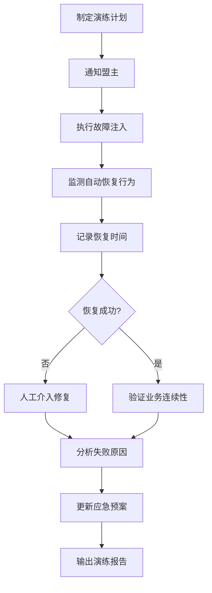

# 天枢权衡 — 高可用容灾建设规划

> Phase 2 交付物：任务拆解表 + 行程台账 + 演练方案

---

## 一、建设任务拆解表

### 批次1（高优先级，6项）

| 任务ID | 建设项 | 实现方案 | 核心配置 | 验收标准 | 优先级 |
|:------|:-------|:---------|:---------|:---------|:------:|
| HA-01 | systemd服务化 | 创建hermes-gateway.service + hermes-agent.service | Restart=always, RestartSec=10s | 进程崩溃后10秒自动重启 | 🔴 **高** |
| HA-02 | 数据自动备份 | 15分钟间隔备份五池JSON+报告+决策日志到本地+GitHub | cron表达式 */15 * * * * | 备份文件可恢复，RPO<15分钟 | 🔴 **高** |
| HA-03 | 备份校验脚本 | 每日自动校验备份文件MD5+JSON格式 | cron 0 6 * * * | 校验报告输出，检测到损坏告警 | 🔴 **高** |
| HA-04 | 一键恢复脚本 | 从GitHub/本地备份恢复五池+报告+配置 | 脚本参数 --from=local/github | 恢复后系统正常运行 | 🔴 **高** |
| HA-05 | 进程监控告警 | 进程健康检查→飞书/邮件告警 | 每5分钟检查 | 进程异常时5分钟内告警 | 🔴 **高** |
| HA-06 | 数据完整性校验 | 五池JSON+决策日志格式+内容校验 | 每日定时执行 | 检测到数据损坏自动告警 | 🔴 **高** |

### 批次2（中优先级，5项）

| 任务ID | 建设项 | 实现方案 | 核心配置 | 验收标准 | 优先级 |
|:------|:-------|:---------|:---------|:---------|:------:|
| HA-07 | 冷备环境搭建文档 | 备机部署步骤+数据同步+切换流程 | 文档化 | 备机可1小时内上线 | 🟡 **中** |
| HA-08 | 配置备份与版本管理 | config.yaml+.env+关键配置定期备份 | 每日备份到GitHub | 配置丢失可恢复 | 🟡 **中** |
| HA-09 | 网络连通性监控 | 自动检测LLM API+行情API+新闻源+GitHub | 每5分钟ping | 网络中断5分钟内告警 | 🟡 **中** |
| HA-10 | 日志自动裁剪 | 日志大小控制+保留30天+自动清理 | cron 每日0点 | 日志目录不超过500MB | 🟡 **中** |
| HA-11 | 可用性仪表盘 | 实时状态+可用性统计 | Web页面 | 可视化系统状态 | 🟡 **中** |

### 批次3（低优先级，4项）

| 任务ID | 建设项 | 实现方案 | 核心配置 | 验收标准 | 优先级 |
|:------|:-------|:---------|:---------|:---------|:------:|
| HA-12 | 故障切换演练 | 模拟进程崩溃→验证自动恢复 | 每月1次 | 切换<5分钟 | 🟢 **低** |
| HA-13 | 数据恢复演练 | 模拟数据损坏→验证恢复 | 每月1次 | 恢复<30分钟 | 🟢 **低** |
| HA-14 | 故障应急预案 | 各类故障响应流程文档 | 文档化 | 所有P0/P1有明确流程 | 🟢 **低** |
| HA-15 | 定期演练机制 | 自动演练+报告 | cron 每月1日 | 演练报告自动生成 | 🟢 **低** |

---

## 二、容灾演练方案

### 演练类型

| 类型 | 场景 | 频率 | 验证目标 |
|:-----|:-----|:----:|:---------|
| 进程故障切换 | 模拟Hermes gateway进程崩溃 | 每月 | 自动重启<10s, 任务恢复<5min |
| 数据损坏恢复 | 模拟五池JSON损坏 | 每月 | 从备份恢复<30min, 数据一致性 |
| 网络中断恢复 | 模拟网络断开后恢复 | 每季 | 恢复后全流程正常运行 |
| 磁盘满恢复 | 模拟磁盘空间不足 | 每季 | 自动清理+告警+恢复 |
| 全量容灾演练 | 模拟服务器完全宕机 | 半年 | 备机部署+数据恢复<1h |

### 演练流程



---

## 三、可用性指标核算

### 改造后预期

| 指标 | 改造前 | 改造后 | 提升 |
|:-----|:------:|:------:|:----:|
| 系统可用率 | 99% | 99.9% | 10x |
| 年宕机时间 | 87小时 | 8.76小时 | -78小时 |
| 单次故障恢复时间 | 数小时 | <5分钟 | 10x+ |
| 数据丢失风险 | RPO 24h | RPO 15min | 96x |
| 故障自动发现 | 无 | 5分钟内 | 从无到有 |

---

## 四、进度台账

> 项目启动时间：2026-07-24
> 当前阶段：Phase 2

### 台账格式

```json
{
  "phase": 2,
  "checkpoint_time": "2026-07-24T16:30:00",
  "items": {
    "HA-01": {"status": "pending", "batch": 1, "type": "systemd"},
    "HA-02": {"status": "pending", "batch": 1, "type": "backup"},
    ...
  }
}
```

---

## 变更记录

| 版本 | 日期 | 变更内容 | 作者 |
|:----:|:----:|---------|:----:|
| v1.0 | 2026-07-24 | 初始创建 | 七郎 |