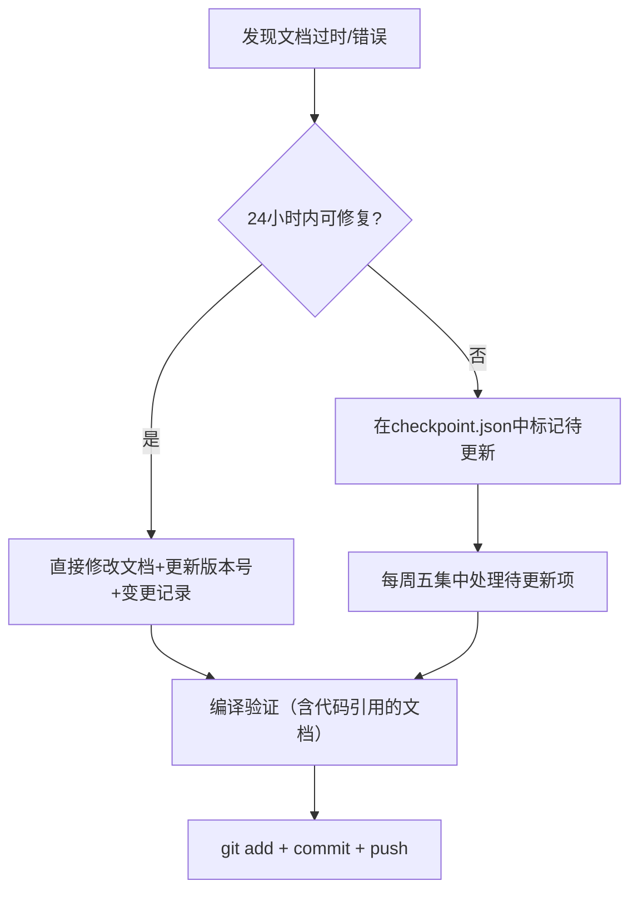

# 天枢权衡知识库 — 维护规范

> **文档ID:** MAINT-01
> **版本:** v1.0
> **最后更新:** 2026-07-24

---

## 一、更新触发条件

| 触发条件 | 更新动作 | 时效 | 责任人 |
|---------|---------|:----:|:------:|
| 新增 Agent/脚本 | 更新 ARCH-02 模块说明 + ARCH-03 目录结构 | 即时 | 七郎 |
| 修改阈值/参数 | 更新 STRAT-09 参数含义 + 标注校准日期 | 即时 | 七郎 |
| 修复 P0 故障 | 追加 TROUBLE-99 案例 + 更新对应排查文档 | 1个工作日内 | 七郎 |
| 版本迭代 | 更新 VERSION-01 变更记录 | 每次提交时 | 七郎 |
| 架构变更 | 更新 ARCH-01/02/05 | 1个工作日内 | 七郎 |
| 新增故障模式 | 新增 TROUBLE-NN 文档 + 更新排查总纲 | 发现后1周内 | 七郎 |
| 策略调整 | 更新对应 STRAT 文档 + 风险收益特征 | 调整后即时 | 七郎 |

## 二、文档版本管理

### 版本号规则

```
v<主版本>.<次版本>
```

- **主版本+1**：架构变化、流程重构、关键策略变更
- **次版本+1**：补充细节、修正错误、新增案例

### 文档头部格式

每个文档必须包含元信息头部：

```markdown
> **文档ID:** ARCH-01
> **版本:** v1.0
> **最后更新:** 2026-07-24
> **维护人:** 七郎
```

### 变更记录

每个文档末尾附加变更记录表：

```markdown
## 变更记录

| 版本 | 日期 | 变更内容 | 作者 |
|:----:|:----:|---------|:----:|
| v1.0 | 2026-07-24 | 初始创建 | 七郎 |
| v1.1 | ... | 补充XX章节 | 七郎 |
```

## 三、文档质量规范

### 命名规范

- 目录名：`NN-分类名/`（NN 为两位数字序号）
- 文件名：`NN-文档名.md`（NN 为两位数字序号）
- 文档ID：`分类缩写-NN`（如 ARCH-01, TROUBLE-99）

### 格式规范

- 使用 Markdown 标准语法
- 代码块标注语言（\`\`\`python, \`\`\`bash, \`\`\`yaml）
- 表格使用标准 Markdown 表格
- 关键路径使用 `mermaid` 流程图（故障排查必备）
- 使用 emoji 标注状态（✅/❌/⚠️/🔄/📌）

### 准确性要求

- 所有文件路径、命令、参数必须与代码实际一致
- 故障排查文档必须经过至少一次实战验证
- 引用代码行号时标注 commit 或版本号

## 四、定期复盘机制

| 周期 | 复盘内容 | 产出 |
|:----:|---------|------|
| 每日 | 新增故障记录 → 检查是否需要更新知识库 | 无（遇事即更） |
| 每周 | 本周修复的 P0/P1 → 检查是否已归档到 TROUBLE-99 | 每周五归档 |
| 每月 | 知识库覆盖度检查 → 是否有遗漏的知识域 | 更新计划 |
| 每季度 | 文档准确性验证 → 对比代码实际行为 | 全量审阅报告 |

## 五、僵尸文档预防

### 自动检测

- 每个文档标注版本号+最后更新日期
- 超过 90 天未更新的文档标记为 ⚠️ 待审阅
- 超过 180 天未更新的文档标记为 🔴 待确认是否过时

### 更新流程

