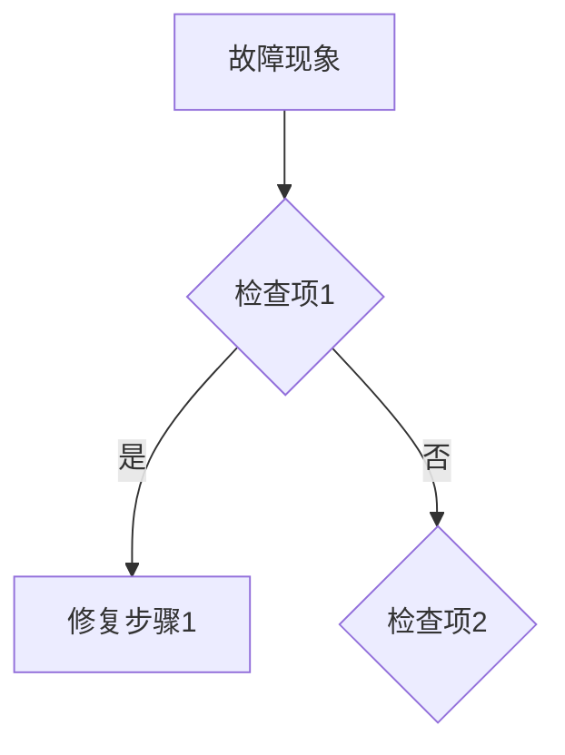

# 天枢权衡知识库 — 建设清单与目录设计

> Phase 1 交付物：知识体系设计 + 文档建设清单

---

## 一、知识库目录结构

```
docs/knowledge-base/
├── README.md                          # 知识库首页与目录
├── navigation-guide.md                # 检索指南（关键词→文档映射）
├── maintenance-guide.md               # 维护规范（更新流程、版本管理、责任人）
│
├── 01-系统架构/
│   ├── 01-总体架构.md                 # 系统整体架构图与数据流
│   ├── 02-模块说明.md                 # 每个 Agent 模块的职责与接口
│   ├── 03-目录结构.md                 # 项目文件结构详解
│   ├── 04-五池系统.md                 # 五池流转规则、容量、阈值
│   ├── 05-数据流与管道.md             # 全流程数据管道（15阶段管线）
│   ├── 06-环境配置.md                 # 环境变量、API凭据、依赖安装
│   ├── 07-配置文件.md                 # config.yaml 参数说明
│   └── 08-依赖组件.md                 # 第三方依赖、版本要求
│
├── 02-操作运维/
│   ├── 01-部署流程.md                 # 从零部署完整流程
│   ├── 02-启停操作.md                 # Hermes Cron 注册/启停/监控
│   ├── 03-日常巡检.md                 # 每日/每周巡检清单
│   ├── 04-定时任务管理.md             # 5个天枢Cron详解（时间线+依赖链）
│   ├── 05-配置修改规范.md             # 阈值修改、参数调整的规范流程
│   ├── 06-报告手动补跑.md             # 各阶段手动补跑命令
│   ├── 07-备份恢复.md                 # 五池备份、数据恢复
│   └── 08-飞书/邮件/Discord投递.md    # 推送渠道配置与故障处理
│
├── 03-故障排查/
│   ├── 00-排查总纲.md                 # 故障分类与排查方法论
│   ├── 01-新闻拉取失败.md             # 新闻源不可用、超时、代理问题
│   ├── 02-LLM调用失败.md              # API超时、模型拒绝、退化检测
│   ├── 03-格式漂移.md                 # LLM输出格式变化导致正则失败
│   ├── 04-降级延迟.md                 # 评分0未降级、低分滞留
│   ├── 05-池异常.md                   # 跨池重复、空池、容量溢出
│   ├── 06-Cron任务异常.md             # 串行阻塞、超时截断、SIGTERM
│   ├── 07-决策异常.md                 # 空仓误报、兜底引擎误触、S池残留
│   ├── 08-邮件投递失败.md             # 反垃圾拦截、脚本报错、附件问题
│   ├── 09-回头看异常.md               # 口径偏差、数据提取失败
│   ├── 10-回测异常.md                 # 双截断、随机因子、重复计数
│   └── 99-历史故障案例库.md           # 所有P0/P1故障的根因+修复+验证
│
├── 04-策略文档/
│   ├── 01-策略总览.md                 # 天枢策略体系概述
│   ├── 02-快筛策略.md                 # 新闻驱动快筛+技术面补位
│   ├── 03-审查评分体系.md             # 四维评分（位置35%+驱动25%+量能20%+风险20%）
│   ├── 04-过热检测.md                 # 6级过热检测规则+市场状态豁免
│   ├── 05-质疑审查Gate.md             # Skeptic五维质疑+加权阻塞
│   ├── 06-决策引擎.md                 # 多级兜底+三段式分流
│   ├── 07-五池流转规则.md             # 升级/降级/淘汰/衰减/三振
│   ├── 08-ML评分模型.md               # RandomForest 9因子+训练数据
│   ├── 09-参数含义与阈值.md           # 所有阈值的来源、校准历史、SSOT
│   ├── 10-风险收益特征.md             # 各分数段历史表现、胜率分布
│   └── 11-市场状态感知.md             # 5档市场状态+规则调整
│
└── 05-迭代历史/
    ├── 01-版本变更记录.md             # 版本号→日期→核心变更
    ├── 02-问题修复历史.md             # 所有P0-P3修复根因+修复+验证
    ├── 03-优化迭代日志.md             # 架构优化、代码重构、性能改进
    ├── 04-回滚方案.md                 # 各模块回滚步骤与检查点
    └── 05-进化路线图.md               # 已完成的进化+未来规划
```

---

## 二、文档建设清单

### 高优先级（运维必备，立即可用）

| 文档ID | 分类 | 文档名称 | 核心内容 | 优先级 | 现有基础 |
|--------|------|---------|---------|:------:|---------|
| ARCH-01 | 01-系统架构 | 总体架构 | 架构图、数据流、Agent间契约 | 🔴 **高** | skill 文档已有概要 |
| ARCH-03 | 01-系统架构 | 目录结构 | 完整文件结构+每个文件职责 | 🔴 **高** | 盘点已完成 |
| ARCH-04 | 01-系统架构 | 五池系统 | 容量、流转规则、阈值、跨池约束 | 🔴 **高** | skill 文档详细 |
| ARCH-06 | 01-系统架构 | 环境配置 | .env、API key、依赖安装 | 🔴 **高** | README 有概要 |
| OPS-01 | 02-操作运维 | 部署流程 | 从零部署完整步骤 | 🔴 **高** | 无独立文档 |
| OPS-03 | 02-操作运维 | 日常巡检 | 盘前/盘中/盘后检查清单 | 🔴 **高** | skill 有检查清单 |
| OPS-04 | 02-操作运维 | 定时任务管理 | 5个Cron详解+时间线+依赖链 | 🔴 **高** | skill 有调度窗口 |
| TROUBLE-01 | 03-故障排查 | 排查总纲 | 分类+排查方法论 | 🔴 **高** | 无独立文档 |
| TROUBLE-99 | 03-故障排查 | 历史故障案例库 | 所有P0/P1故障档案 | 🔴 **高** | 分散在232个references |
| VERSION-01 | 05-迭代历史 | 版本变更记录 | 版本号→日期→核心变更 | 🔴 **高** | 分散在git log+references |

### 中优先级（策略与故障，需系统梳理）

| 文档ID | 分类 | 文档名称 | 核心内容 | 优先级 | 现有基础 |
|--------|------|---------|---------|:------:|---------|
| ARCH-02 | 01-系统架构 | 模块说明 | 54个Agent模块+20个脚本职责 | 🟡 **中** | 无独立文档 |
| ARCH-05 | 01-系统架构 | 数据流与管道 | 全流程15阶段管线+数据格式 | 🟡 **中** | references 有 |
| OPS-02 | 02-操作运维 | 启停操作 | Cron注册/启停/监控 | 🟡 **中** | 无独立文档 |
| OPS-05 | 02-操作运维 | 配置修改规范 | 阈值修改的规范流程 | 🟡 **中** | skill 有原则 |
| TROUBLE-02 | 03-故障排查 | 新闻拉取失败 | 新闻源不可用、代理问题 | 🟡 **中** | 分散在references |
| TROUBLE-03 | 03-故障排查 | LLM调用失败 | API超时、退化、模型拒绝 | 🟡 **中** | 分散在references |
| TROUBLE-04 | 03-故障排查 | 格式漂移 | LLM输出格式变化 | 🟡 **中** | 有专门analysis |
| TROUBLE-05 | 03-故障排查 | 降级延迟 | 评分0未降级 | 🟡 **中** | 多次修复记录 |
| TROUBLE-06 | 03-故障排查 | 池异常 | 跨池重复、空池 | 🟡 **中** | 分散在references |
| STRAT-01 | 04-策略文档 | 策略总览 | 体系概述 | 🟡 **中** | 无独立文档 |
| STRAT-02 | 04-策略文档 | 快筛策略 | 新闻驱动+技术面补位 | 🟡 **中** | 分散在references |
| STRAT-03 | 04-策略文档 | 审查评分体系 | 四维评分+权重 | 🟡 **中** | skill 有 |
| STRAT-09 | 04-策略文档 | 参数含义与阈值 | 所有阈值SSOT | 🟡 **中** | thresholds.py 有 |
| VERSION-02 | 05-迭代历史 | 问题修复历史 | P0-P3修复 | 🟡 **中** | 分散在references |

### 低优先级（沉淀类，可后续补充）

| 文档ID | 分类 | 文档名称 | 核心内容 | 优先级 | 现有基础 |
|--------|------|---------|---------|:------:|---------|
| ARCH-07 | 01-系统架构 | 配置文件 | config.yaml 参数详解 | 🟢 **低** | 无 |
| OPS-06 | 02-操作运维 | 报告手动补跑 | 各阶段补跑命令 | 🟢 **低** | 无 |
| OPS-07 | 02-操作运维 | 备份恢复 | 五池备份+数据恢复 | 🟢 **低** | 有脚本 |
| TROUBLE-07 | 03-故障排查 | 决策异常 | 空仓误报、兜底误触 | 🟢 **低** | 分散在references |
| TROUBLE-08 | 03-故障排查 | 邮件投递失败 | 反垃圾、脚本错误 | 🟢 **低** | 分散在references |
| STRAT-04 | 04-策略文档 | 过热检测 | 6级规则+豁免 | 🟢 **低** | skill 有 |
| STRAT-05 | 04-策略文档 | 质疑审查Gate | Skeptic五维 | 🟢 **低** | skill 有 |
| STRAT-06 | 04-策略文档 | 决策引擎 | 多级兜底 | 🟢 **低** | skill 有 |
| STRAT-07 | 04-策略文档 | 五池流转规则 | 升级/降级/衰减 | 🟢 **低** | 规则库/有 |
| VERSION-03 | 05-迭代历史 | 优化迭代日志 | 架构优化 | 🟢 **低** | 分散 |
| VERSION-04 | 05-迭代历史 | 回滚方案 | 回滚步骤 | 🟢 **低** | 无 |

---

## 三、文档模板

### 系统架构类模板

```markdown
# [文档标题]

> **文档ID:** ARCH-XX
> **版本:** v1.0
> **最后更新:** YYYY-MM-DD
> **维护人:** 七郎

---

## 概述

[一句话描述本文档覆盖的内容范围]

## 架构图

[ASCII架构图或文字描述]

## 核心组件

| 组件 | 职责 | 输入 | 输出 | 关键文件 |
|------|------|------|------|---------|
| ... | ... | ... | ... | ... |

## 数据流

[数据流向说明]

## 关键规则

[业务规则、约束条件]

## 相关文档

- [链接到其他文档]
```

### 故障排查类模板

```markdown
# [故障标题]

> **故障ID:** TROUBLE-XX
> **分类:** [故障分类]
> **严重级别:** P0/P1/P2
> **最后更新:** YYYY-MM-DD

---

## 故障现象

[用户感知到的现象]

## 排查路径



## 根因分析

[技术根因]

## 解决方案

[操作步骤，新人可独立执行]

## 验证方法

[如何确认修复成功]

## 历史案例

| 日期 | 触发条件 | 根因 | 修复方式 | 提交 |
|------|---------|------|---------|------|
| ... | ... | ... | ... | ... |
```

---

## 四、更新机制

### 更新触发条件

| 触发条件 | 更新要求 | 时效 |
|---------|---------|:----:|
| 新增 Agent/脚本 | 在 ARCH-02/03 中补充 | 即时 |
| 修改阈值/参数 | 在 STRAT-09 中更新+标注校准日期 | 即时 |
| 修复 P0 故障 | 在 TROUBLE-99 中追加案例+更新对应排查文档 | 1个工作日内 |
| 版本迭代 | 在 VERSION-01 中追加记录 | 每次提交时 |
| 架构变更 | 更新 ARCH-01/02/05 | 1个工作日内 |

### 文档版本管理

- 每个文档正文标注版本号 `vX.Y`
- 主版本变更（架构/流程改变）→ 大版本+1
- 次版本变更（补充细节/修正错误）→ 小版本+1
- 文档末尾附变更记录表

---

## 五、建设计划

### 批次1（高优先级，10篇）

| 批次 | 文档ID | 文档名称 | 估时 |
|:----:|--------|---------|:----:|
| 1-1 | ARCH-01 | 总体架构 | 30min |
| 1-2 | ARCH-03 | 目录结构 | 20min |
| 1-3 | ARCH-04 | 五池系统 | 30min |
| 1-4 | ARCH-06 | 环境配置 | 15min |
| 1-5 | OPS-01 | 部署流程 | 25min |
| 1-6 | OPS-03 | 日常巡检 | 20min |
| 1-7 | OPS-04 | 定时任务管理 | 20min |
| 1-8 | TROUBLE-01 | 排查总纲 | 15min |
| 1-9 | TROUBLE-99 | 历史故障案例库 | 45min |
| 1-10 | VERSION-01 | 版本变更记录 | 20min |

### 批次2（中优先级，13篇）

| 批次 | 文档ID | 文档名称 | 估时 |
|:----:|--------|---------|:----:|
| 2-1 | ARCH-02 | 模块说明 | 30min |
| 2-2 | ARCH-05 | 数据流与管道 | 25min |
| 2-3 | OPS-02 | 启停操作 | 15min |
| 2-4 | OPS-05 | 配置修改规范 | 15min |
| 2-5 | TROUBLE-02 | 新闻拉取失败 | 20min |
| 2-6 | TROUBLE-03 | LLM调用失败 | 20min |
| 2-7 | TROUBLE-04 | 格式漂移 | 15min |
| 2-8 | TROUBLE-05 | 降级延迟 | 15min |
| 2-9 | TROUBLE-06 | 池异常 | 15min |
| 2-10 | STRAT-01 | 策略总览 | 20min |
| 2-11 | STRAT-02 | 快筛策略 | 20min |
| 2-12 | STRAT-03 | 审查评分体系 | 25min |
| 2-13 | STRAT-09 | 参数含义与阈值 | 30min |

### 批次3（低优先级，11篇）

| 批次 | 文档ID | 文档名称 | 估时 |
|:----:|--------|---------|:----:|
| 3-1~3-11 | 剩余11篇 | 详见建设清单 | 各15min |

---

## 六、进度台账

> 项目启动时间：2026-07-24
> 当前阶段：Phase 1 知识盘点与体系设计 ✅

### 台账格式

```json
{
  "phase": 1,
  "checkpoint_time": "2026-07-24T16:00:00",
  "status": {
    "phase1": {"status": "completed", "note": "知识盘点+目录设计+建设清单"},
    "phase2": {"status": "pending", "note": ""},
    "phase3": {"status": "pending", "note": ""},
    "phase4": {"status": "pending", "note": ""}
  },
  "documents": {
    "ARCH-01": {"status": "pending", "batch": 1},
    ...
  }
}
```